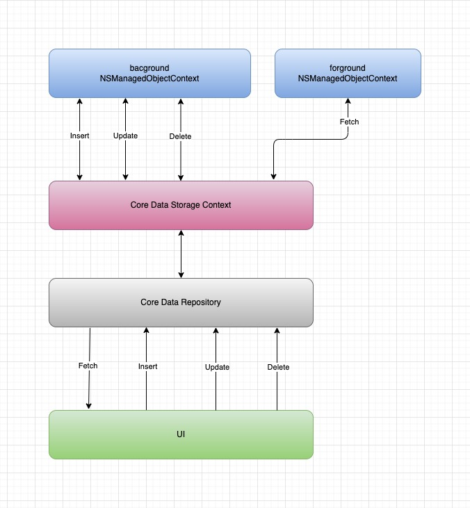

<div align="center">


 

<br />

# Core Data Combine Kit
### A light weight library for manipulating the main Core Data actions with Combine framework compatibility.


<br /><br />Dependency managers<br />

<a href="https://cocoapods.org/pods/CoreStore"></a>
<a href="https://swift.org/source-compatibility/#current-list-of-projects"></a>


<br />

</div>

* **Swift 5.5:** iOS 13.1+ / macOS 10.15+


## Architecture
All fetching requests execusting on the main thread with the main context, But insert, update and delete requests are executing on a background thread.

 

    
## Installation
- Requires:
    - iOS 13.1 SDK and above
    - Swift 5.2 (Xcode 11.4+)
- Dependencies:
    - *None*
- Other notes:
    - The fetch requests executes on the main context (Main Thread).
    - Insert, Update, Delete and DeleteAll all are executing on the background context (Background Thread).

------------

### Install with CocoaPods
In your `Podfile`, add
```
pod 'CoreDataCombineKit'
```
and run 
```
pod install
```
This installs CoreDataCombineKit as a framework. Declare `import CoreDataCombineKit` in your swift file to use the library.

------------

#### Install with Swift Package Manager:
```swift
dependencies: [
    .package(url: "https://github.com/ramyaimansabry/CoreDataCombineKit.git", from: "0.0.1"))
]
```
Declare `import CoreDataCombineKit` in your swift file to use the library.

------------

## Authors

- [Ramy Sabry](https://www.linkedin.com/in/ramy-aiman-sabry-153770117/)

  

